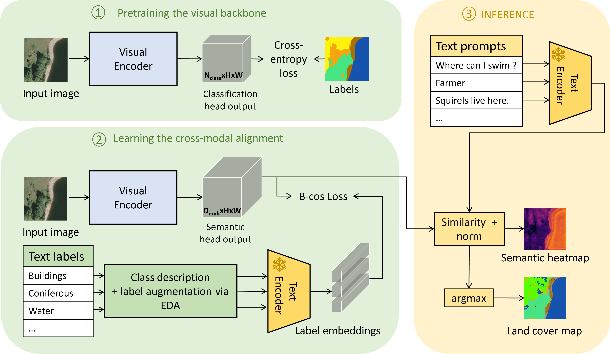
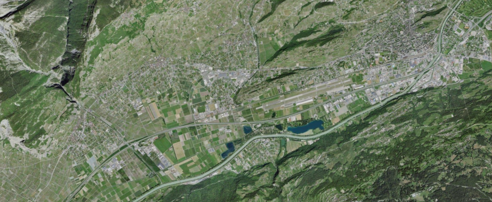
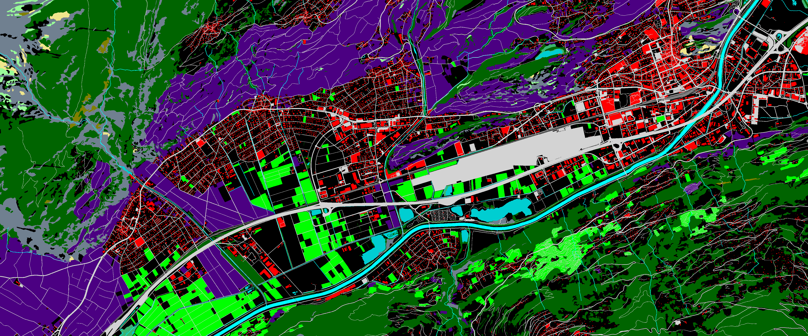
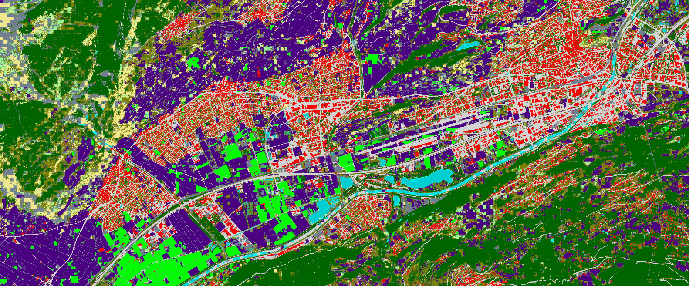
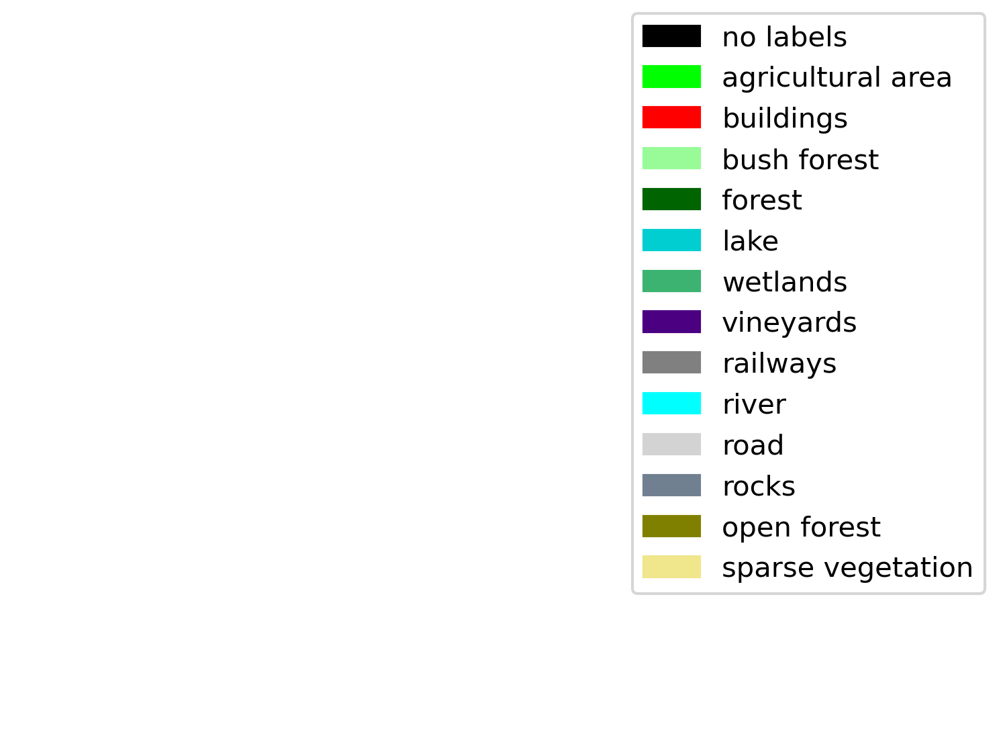

<h1 style="text-align: center;"> :taco:  TACOSS : Learning transferable land cover semantics for open
vocabulary interactions with remote sensing images.</h1>

<a href="https://orcid.org/0009-0008-1527-3913">Valerie Zermatten </a>,<a href="https://orcid.org/0000-0001-5607-4445"> Javiera Castillo-Navarro </a>,<a href="https://orcid.org/0000-0001-5607-4445"> Diego Marcos </a>,<a href="https://orcid.org/0000-0003-0374-2459"> Devis Tuia</a>

<h2>Overview</h2>

This repository proposes Text As supervision for COntrastive Semantic Segmentation (**TACOSS**), an open vocabulary semantic segmentation model for remote sensing images.
TACOSS leverages the common sense knowledge captured by language models and is capable of interpreting the image at the pixel level, attributing semantics to each pixel and removing the constraints of a fixed set of land cover labels.

This project intends to not only simplify the map creation process but also bridge the gap between complex remote sensing technology and user-friendly applications, eventually
making advanced mapping tools accessible to everyone. 




<h2>Code usage </h2>

Interested in trying out? 

First install the necessary dependencies and download the models/data. 

<h3>Code requirements (installation) </h3>

Required python packages are listed in the requirements.yml which can be used to build a conda environment.

```
conda env create --file environment.yml
conda activate tacoss
```

Or  use the provided "Dockerfile"

<h3>Data requirements</h3>

For trying out the TACOSS, please download the model weights available in zenodo : [](https://doi.org/10.5281/zenodo.13361624).

First clone this repository, then copy the model weights files in the folder `/output`, and the labels embeddings in the folder `/data`

- The  FLAIR  dataset is available on the IGN website  [ FLAIR challenge](https://ignf.github.io/FLAIR/#FLAIR1).

- The TLM aerial images can be downloaded from the [swissIMAGE 10cm website ](https://www.swisstopo.admin.ch/de/orthobilder-swissimage-10-cm)

- The TLM annotations can be downloaded as shapefile 'BodenBeckdung' on the [swissTLM3d website](https://www.swisstopo.admin.ch/de/landschaftsmodell-swisstlm3d)
    - The TLM dataset as used in this repository can be provided on request by contacting the authors.


<h3>Model training</h3>


Several configuration files are provided in the `config` folder. 
To launch  experiments based on the existing configuration files, use the following command line :
```
python main.py --cfg <config_name>

# Train Segforme baseline model :
python main.py --cfg segformer-base

# Train DeepLabv3+ baseline model :
python main.py --cfg dlv-base

# Train TACOSS with the segformer visual backbone and the SentenceBERT text encoder : 
python main.py --cfg segformer-bcos-sbert-des-eda

# Train TACOSS with the DeepLabv3+ backbone and CLIP text encoder :
python main.py --cfg dlv-bcos-clip-name
```

Experiments with the CLIPSeg model requires a specific dataset class for its training and inference, since CLIPSeg is trained as a binary segmentation task with a binary cross entropy loss. To train and evaluate CLIPSeg, use the `CLIPSeg` folder and the `CLIPSegFinetune.py` script.


<h2>Results</h2>

Qualitative performance of TACOSS on the FLAIR dataset : 


Qualitative performance of TACOSS on the TLM dataset (in a transfert setting ) : 
<figcaption>Fig. 1 : Aerial view :</figcaption>


<figcaption>Fig. 2 : TLM labels :</figcaption>


<figcaption>Fig. 3 : TACOSS predictions :</figcaption>


TACOSS predictions


    


More examples can be found in the associated publication **[under review]**.


<h2>Future directions</h2>

This project proposes the development of remote sensing specific vision-language models to facilitate the interactions with RS images. Our work showed a proof a principle.

In principle, to be more usable, TACOSS  requires from multiple improvements:
- Extend TACOSS to more geographical regions, sensors and spatial resolution. Currently, the model was trained only on high resolution (30cm) images with RGB bands.
- Improve fine-tuning of TACOSS from few land cover labels to a larger set of labels and more diverse description of land cover.
- Improve open-vocabulary capabilities of TACOSS.


<h2>Contributing</h2>

If you are interested in contributing to one of the aforementioned points, or work on a similar project and wish to collaborate, please reach out to [ECEO](https://www.epfl.ch/labs/eceo).

For code related contributions, suggestions or inquires, please open a github issue. 


<h2>Code acknowledgments</h2>

We acknowledge the following code repositories that helped to build the TACOSS repository :  

- https://github.com/amathislab/wildclip

- https://github.com/hugoporta/segmentation-prototype/


Thank you! Others smaller sources are mentioned in the relevant code sections. 
